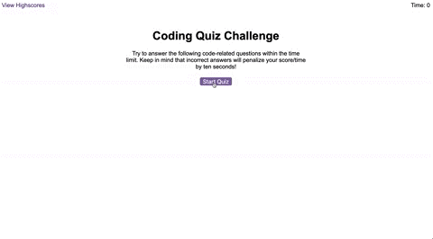

# Page-JavaScript
## Variables

Variables are used to keep track of the quiz state, reference DOM elements, and manage sound effects. Some important variables include:
- `currentQuestionIndex`: Keeps track of the current question index.
- `time`: Represents the remaining time for the quiz.
- Variables referencing DOM elements such as `questionsEl`, `timerEl`, `choicesEl`, etc.
- Sound effects variables `sfxRight` and `sfxWrong`.

## Usage

To start the quiz, click the "Start" button. Answer the questions by clicking on the choices provided. Upon completing the quiz or running out of time, you will be redirected to the end screen where you can save your high score.

## live Demo

## Dependencies

This application relies on sound effects files located in the assets directory:
- `correct.wav`
- `incorrect.wav`

## Technologies used
CSS, HTML, Javascript

## Compatibility

This quiz application should work on modern web browsers with JavaScript enabled.

